#
REDES DE COMPUTADORAS 1 \
ING. PEDRO HERNANDEZ \
AUX. MELANI LOPEZ 

CHRISTIAN ALESSANDER BLANCO GONZALEZ \
202000173

#

 <h1>PRACTICA 1</h1> 

  

## CONFIGURACIÓN DE VPCs
1. VPC del computador para el administrador.

    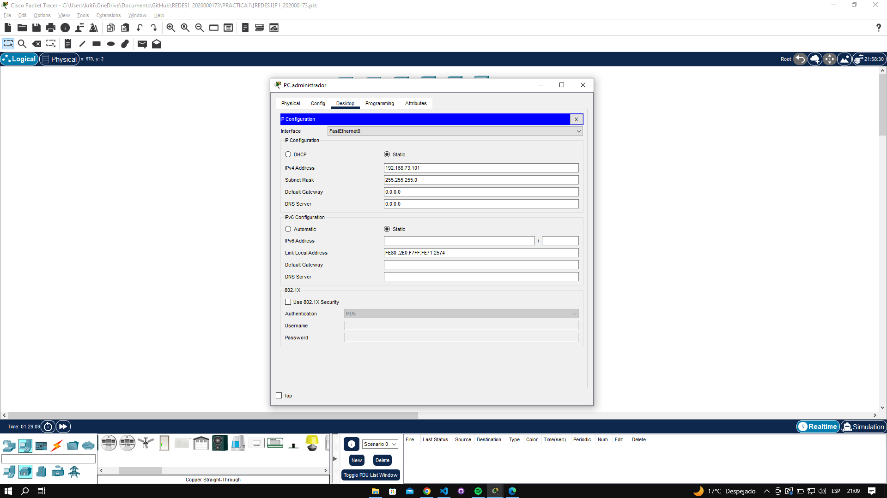

2. VPC del área gerencial.

    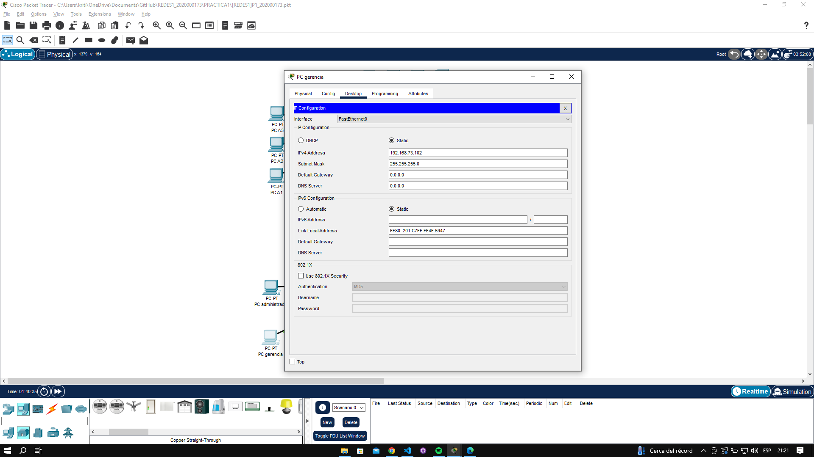

3. VPC del área de atención al cliente.

    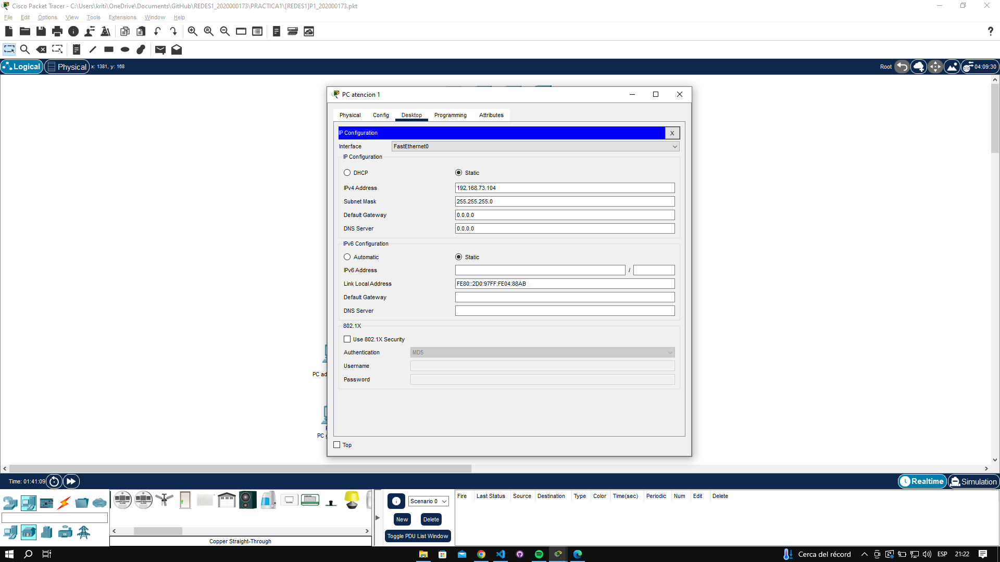

4. VPC del área de recursos humanos.

    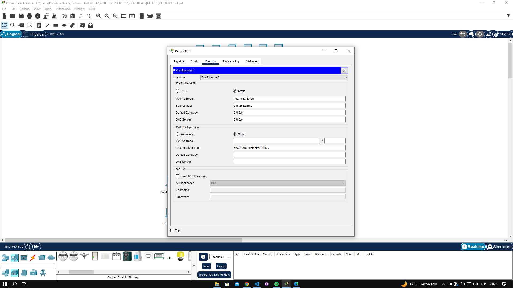

5. VPC de la oficina A.

    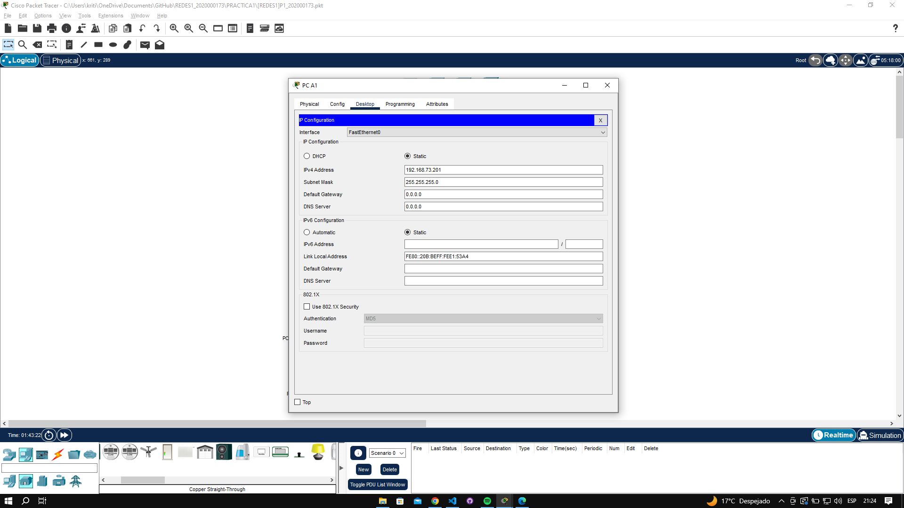

6. VPC de la oficina B.

    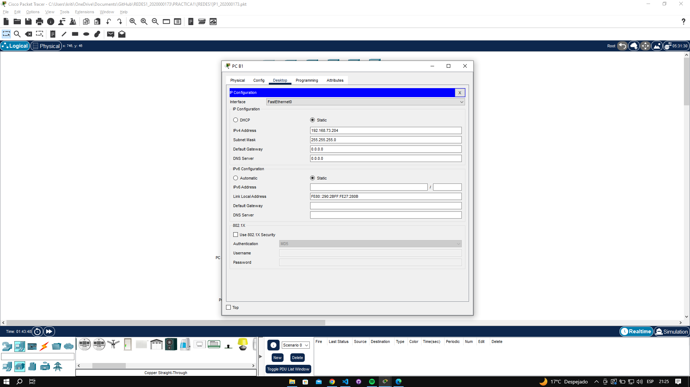

7. VPC de la oficina C.

    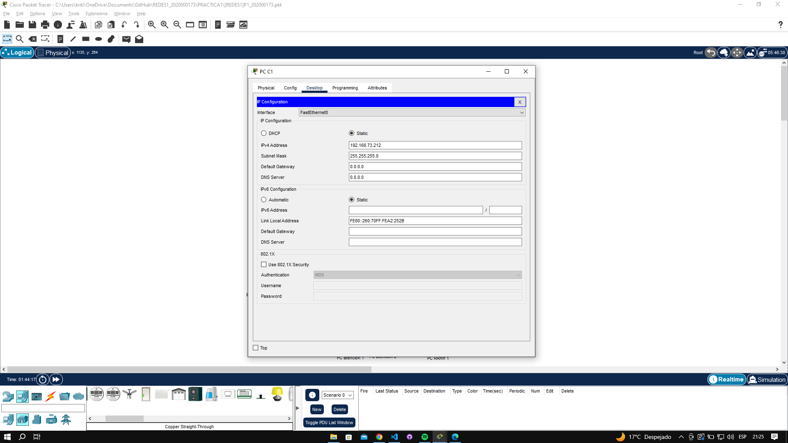

## PING ENTRE HOSTS

1. Realizaremos la comunicación de la máquina del administrador (192.168.73.101) hacia la segunda máquina de la oficina A (192.168.73.202).

    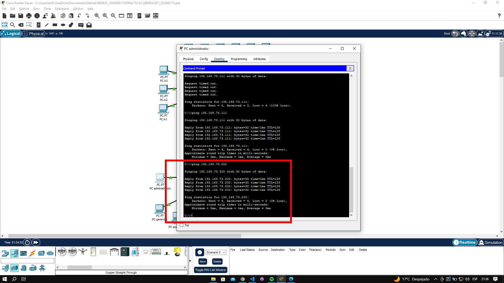

2. Realizaremos la comunicación de la tercera máquina de recursos humanos (192.168.73.108) hacia la máquina del gerente (192.168.73.102).

    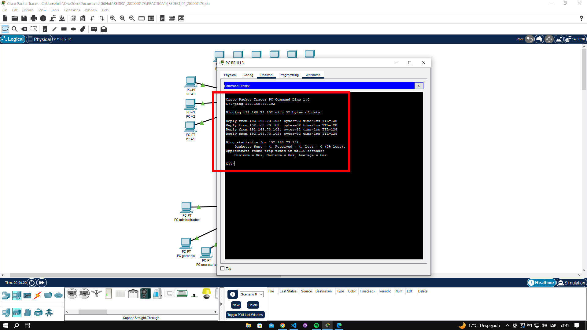

3. Realizaremos la comunicación de la cuarta máquina de la oficina B (192.168.73.207) hacia la segunda máquina de atención al cliente (192.168.73.105).

    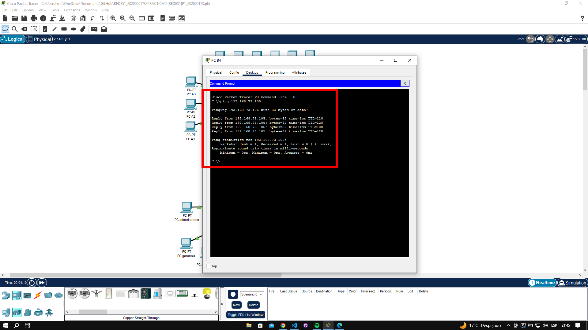

## PAQUETE ARP/ICMP

A continuación se estará mostrando lo que es el paquete ICMP de la máquina administrador hacia la segunda máquina de la oficina A:

1. Enviando paquete:

    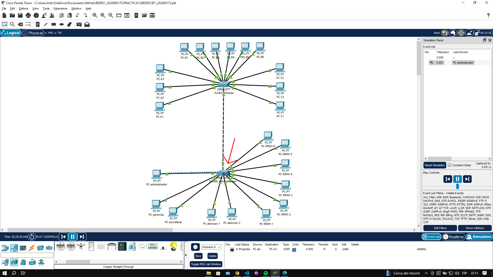

2. Recibiendo paquete:

    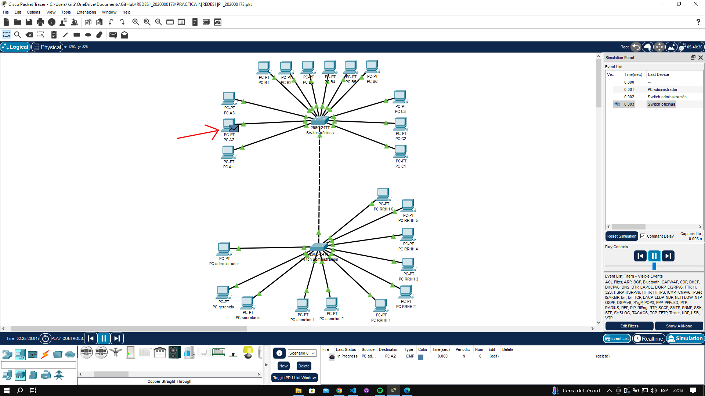

3. Regresando paquete:

    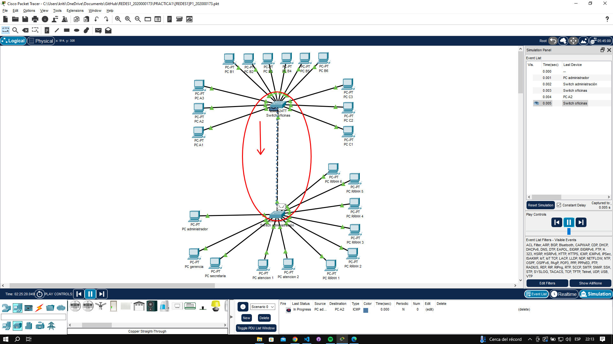

4. Ping exitoso:

    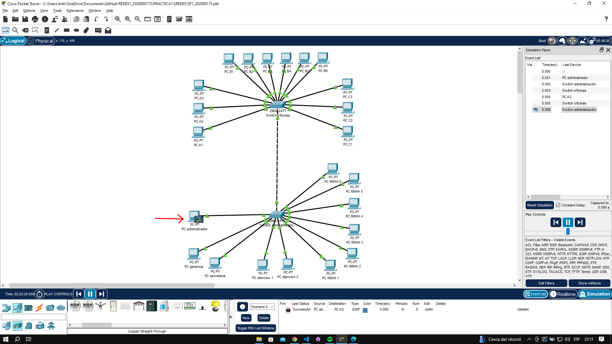

    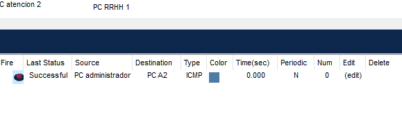

## ANEXOS

En esta prácita se realizó un boceto en formato svg para poder entender el diagrama de dicha tipología de la red, tanto del primer y segundo nivel, conectandolos también a su respectivo switch e identificando cada máquina en su área respectiva:

