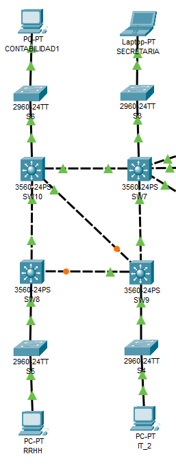
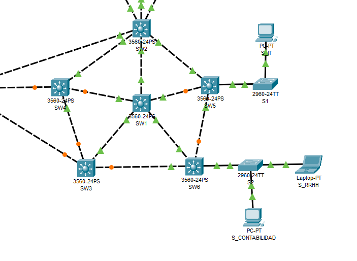
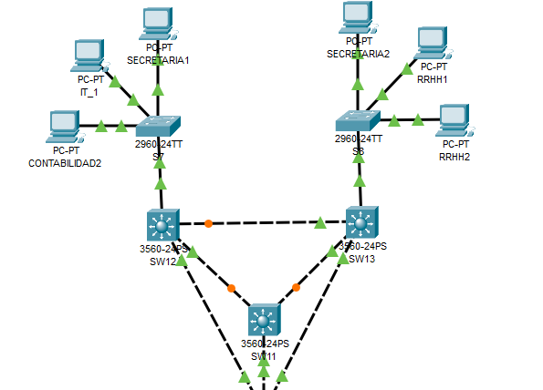
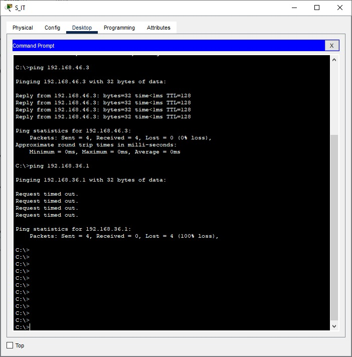
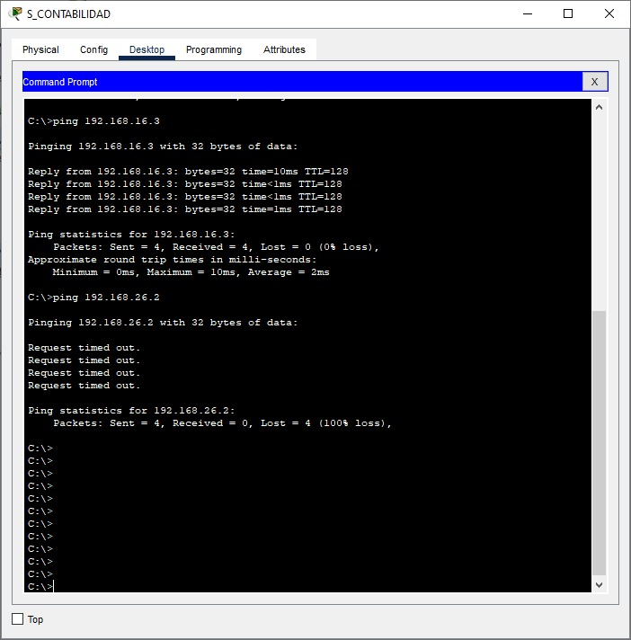

# PROYECTO 1 - REDES 1 

- **Luis Manuel Chay Marroquín // 202000343**
- **Christian Alessander Blanco González // 202000173**

# Direcciones IP y VLAN
La empresa con cuatro departamentos (Contabilidad, Secretaria, Recursos Humanos RRHHH e Informática IT) y se solicito que no exista transito de datos entre departamentos por lo que se crearan 4 VLANs.

| Departamento| VLAN | ID de red |
|------------ |------|-----------|
| Contabilidad| 1X   | 192.168.1x.0/24    |
| Secretaria  | 2X   | 192.168.2x.0/24  |
| RRHH        | 3X   | 192.168.3x.0/24   |
| IT          | 4X   | 192.168.4x.0/24   |

Donde X es la suma del ultimo digito del carnet de los estudiantes, en este caso es 3+3 = 6.

#### Contabilidad
- VLAN: 16

| Equipo| IP   | 
|-------------|------|
| Contabilidad Server| 192.168.16.01  | 
| Contabilidad 1  | 192.168.16.02   | 
| Contabilidad 2        | 192.168.16.03   | 

#### Secretaria
- VLAN: 26

| Equipo| IP   | 
|-------------|------|
| Secretaria Server| 192.168.26.01  | 
| Secretaria 1  | 192.168.26.02   | 
| Secretaria 2        | 192.168.26.03   | 

#### Recursos Humanos
- VLAN: 36

| Equipo| IP   | 
|-------------|------|
| RRHH Server| 192.168.36.01  | 
| RRHH   | 192.168.36.02   | 
| RRHH 1        | 192.168.36.03   | 
| RRHH 2        | 192.168.36.04   | 


#### Informática
- VLAN: 46

| Equipo| IP   | 
|-------------|------|
| IT Server| 192.168.46.01  | 
| IT 1  | 192.168.46.02   | 
| IT 2        | 192.168.46.03   | 

# Topologías
## Centro administrativo


## Backbone


## Area de trabajo



# Comandos utilizados

## Configuracion modo servidor
```bash
    configure terminal
	vtp mode server
	vtp domain P31
	vtp password usac
	vtp version 2
	exit
	wr
```

## Configuracion modo cliente
```bash
    enable
	configure terminal
	vtp mode client
	vtp domain P31
	vtp password usac
	exit
	wr
```

## Configuracion modo truncal
```bash
    enable
	configure terminal
	interface range f0/rango
	switchport mode trunk
	switchport trunk allowed vlan all
	exit
	exit
	wr
```

## Configuracion VLAN
```bash
    enable
    configure terminal
    vlan 16
    name Contabilidad
    exit
    vlan 26
    name Secretaria
    exit
    vlan 36
    name RRHH
    exit
    vlan 46
    name IT
    exit
    wr
```

## Configuración de los puntos de acceso
```bash
    enable
    configure terminal
    interface range f0/rango
    switchport mode access
    switchport access vlan 16
    exit
    exit
    wr
```

## Configuración modo transparente
```bash
vtp mode transparent
vtp domain dominio
vtp password contrasena
```

## Configuración STP
```bash
conf t
spanning-tree mode rapid-pvst
```


# Pings 
#### Comunicación de informatica en su misma VLAN y hacia otra VLAN
- 192.168.46.01 -> 192.168.16.03 (Comunicacion en la misma VLAN, se hace el ping correctamente)
- 192.168.46.01 -> 192.168.36.01 (Comunicacion hacia una VLAN diferente, no se hace el ping correctamente, por lo que esta bien configurada la VLAN)
- 
#### Comunicación de Contabilidad en su misma VLAN y hacia otra VLAN
- 192.168.16.01 -> 192.168.16.03 (Comunicacion en la misma VLAN, se hace el ping correctamente)
- 192.168.16.01 -> 192.168.26.02 (Comunicacion hacia una VLAN diferente, no se hace el ping correctamente, por lo que esta bien configurada la VLAN)
- 